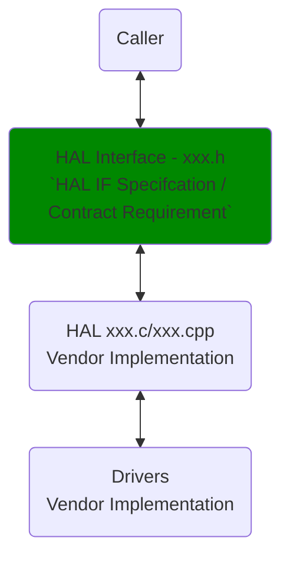
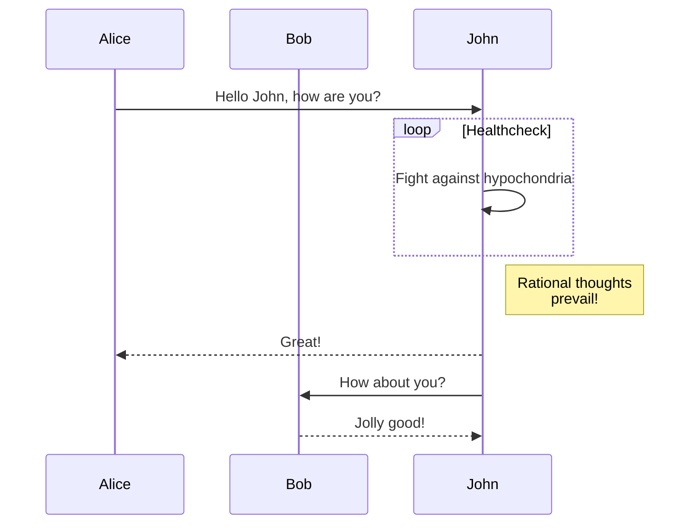
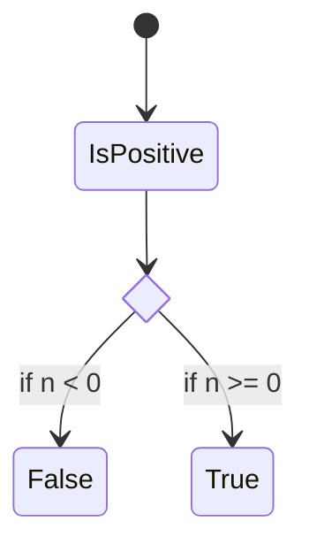

# Name_Of_Component HAL Documentation

# History

|Version|Date|Author|
|-------|-----|-----|
|1.0.0| 22/07/01 (Reverse Date)|Joe Bloggs|

Version format to be defined. Proposal: Major.Minor.Doc 

The version should increment with:

- Doc: A change in the documentation. Since the documentation defines sematic operation, it is important as an interface header definition change. It is backward compatible because it does not change the ABI.
- Minor: A backward compatible change to the API. Defined as no change to the ABI exposed by the library that is used by the client.
- Major: A non-backward compatible change to the API.

A version history should always be provide to track the evolution of the
Component interface.

## Acronyms

Generate a list of acronyms from the source code and specification so that 

----

## Example Satement - Acronyms

"The following table lists acronyms identified within the `xxx.md` and `xxx.h` files. These acronyms were extracted by carefully reviewing the documents for abbreviations and their corresponding definitions. Note that this list may not be exhaustive, as some acronyms might be used contextually without explicit definition."

----

# Description

A description of services provided by the interface, including a diagram if possible showing the relationships.

Where salient, what it does not need to do.

----

### Example Diagram

This diagram can be tailoured to your needs as required.

----

# Component Runtime Execution Requirements

These requirements ensure that the component implementing the interface,
executes correctly within the run-time environment that it will be used.

Failure to meet these requirements will likely result in undefined and
unexpected behaviour.

## Initialization and Startup

Is the RDK-V middleware expected to have complete control over the life cycle
over the entity controlled by the interface?  
For example we have potential two types of entity for which an interface is
being abstracted:

  1. an entity that only needs to exist from initialisation and termination by the and RDK MW manager. When initialised, all resources are acquired, any hardware is opened and configured as a result of calls to interface methods and when terminated all resources are released. Typically the implementation would be self-contained within the library exposing the HAL interface, very probably providing a direct mapping onto a Linux device through a dev node

  2. an entity for which the HAL interface is a proxy. Here the entity is expected to be initialized from outside of the RDK middleware to perform some function before the RDK middleware is executing and ready

The first type is relatively straight forward, the second is more problematic
and needs to be called out and special cases need to be defined:

  1. What should happen when the component/sub-system is not ready. Should the interface block or return not ready. How should the client behave in both respects?

  2. Certain subsystems may have responsibility during system startup before RDK takes control. e.g FrontPanel, Panel and HDMI need to display a splash, etc. What is then the behaviour of the interface and how should it affect this initial state. When is the control hand-over and what state is the sub-system left in at that point? When is the sub-system initialized?

  3. etc.

All these points and others need to be called out so that the system behaves
in a deterministic manner, every time.

## Threading Model

Is it a requirement for the methods exposed by the interface to be thread
safe?

Another point is to define whether the library exposing the interface is
allowed to create threads. If it is allowed, explain the constraints, if any,
around signal handling that the component needs to comply with. If the library
is not allowed to create threads, and a separate thread of execution is
required, it is likely that this dictates the need for a separate process and
the proxy information above applies.

----

## Example Statement - Threading Model

Vendors may implement internal threading and event mechanisms to meet their operational requirements. These mechanisms must be designed to ensure thread safety when interacting with HAL interface. Proper cleanup of allocated resources (e.g., memory, file handles, threads) is mandatory when the vendor software terminates or closes its connection to the HAL.

----

## Process Model

Is it a requirement for the component to support multiple instantiation from
multiple processes, or is there only ever one process that uses the interface?

## Memory Model

If the interface is expected to allocate and return pointers to memory, what
are the expected rules with respect to ownership, clean up and termination.

----

### Example Statement - Memory Model - Option 1 

**Caller Responsibilities:**

- Manage memory passed to specific functions as outlined in the API documentation. This includes allocation and deallocation to prevent leaks.

**Module Responsibilities:**

- Handle and deallocate memory used for its internal operations.
- Release all internally allocated memory upon closure to prevent leaks.

----

**Module Responsibilities:**

- Modules must allocate and de-allocate memory for their internal operations, ensuring efficient resource management.
- Modules are required to release all internally allocated memory upon closure to prevent resource leaks.
- All module implementations and caller code must strictly adhere to these memory management requirements for optimal performance and system stability. Unless otherwise stated specifically in the API documentation.
- All strings used in this module must be zero-terminated. This ensures that string functions can accurately determine the length of the string and prevents buffer overflows when manipulating strings.

## Power Management Requirements

Is there a requirement for the component to participate in power management.  
If so how?  
e.g.  
Is it explicit: The component is terminated by the client before entering a
low power state and it expected that the component puts any associated
hardware in a low power mode?  
Is it implicit, in that when the system, is put in a low power state the
associated hardware is put into a low power state by the operating system
cooperating with the drivers?  
etc.

## Asynchronous Notification Model

Must the component support asynchronous notifications?  
If yes what is the approach?  
Callbacks?  
Blocked call?  
etc.  
If callbacks, the component will be providing the execution context, what are
the threading rules?

If messages are shared, what are responsibilities for managing the memory
allocation, etc.

----

### Example Statement - Asynchronous Notification Model

This API is called from a single thread context, therefore is must not suspend.

## Blocking calls

Are any of the exposed methods allowed to block (sleep or make system calls
that can block)?  
Call out specific methods that are allowed to block.  
How is a blocked call prematurely terminated?

----
### Example Statement - Blocking calls

**Synchronous and Responsive:** All APIs within this module should operate synchronously and complete within a reasonable timeframe based on the complexity of the operation. Specific timeout values or guidelines may be documented for individual API calls.

**Timeout Handling:** To ensure resilience in cases of unresponsiveness, implement appropriate timeouts for API calls where failure due to lack of response is a possibility.  Refer to the API documentation for recommended timeout values per function.

**Non-Blocking Requirement:** Given the single-threaded environment in which these APIs will be called, it is imperative that they do not block or suspend execution of the main thread. Implementations must avoid long-running operations or utilize asynchronous mechanisms where necessary to maintain responsiveness.

----

## Internal Error Handling

If the component detects an internal error (e.g. out of memory) what should it
do?

### Example Statement - Internal Error Hanlding

**Synchronous Error Handling:** All APIs must return errors synchronously as a return value. This ensures immediate notification of errors to the caller.
**Internal Error Reporting:** The HAL is responsible for reporting any internal system errors (e.g., out-of-memory conditions) through the return value.
**Focus on Logging for Errors:** For system errors, the HAL should prioritize logging the error details for further investigation and resolution.

----

## Persistence Model

Is the sub-system interfaced to by the HAL interface expected to remember any
configuration set by calls to the HAL interface?  
How and when is the expected configuration to be applied. Linked to
Initialization and startup above.  
If configuration is expected to be maintained, how is it reset back to
defaults and what implications are there w.r.t upgrading and downgrading of
the subsystem.  
How would this be managed?

# Non functional requirements

Any non-functional requirements not specific to the operation of the
components and interfaces.

## Logging and debugging requirements

Is the component expected to provide logging for debug and diagnostic
purposes?  
If yes, are there any rules (file naming conventions, etc.) that the component
should abide by?

----

### Example Statement - Logging and debugging requirements - option 1

The component must log all errors and critical informative messages.  Use the syslog facility for structured logging and potential remote logging capabilities.  These logs are essential for debugging and understanding the system's operation.

Guidelines

- **Consistency**: Strive for consistent logging practices across all HAL components for better troubleshooting.
- **Logs:** Store logs in the file /rdklogs/logs/xxxx_hal.log.

Log Levels: Use standard Linux log levels as follows:

- **FATAL**: System cannot continue.
- **ERROR**: Error condition preventing a specific operation.
- **WARNING**: Unusual condition, but not immediately hindering.
- **NOTICE**: Normal but noteworthy condition.
- **INFO**: Informational message.
- **DEBUG**: Low-level debugging information.
- **TRACE**: Highly detailed tracing information.

Message Formatting: Include timestamps, component names, severity levels, and clear messages. Consider a standard format.
Log Rotation: Implement log rotation (logrotate) to manage log size.

----

### Example Statement - Loggign and debugging requirements - option 2

The component is required to record all errors and critical informative messages to aid in identifying, debugging, and understanding the functional flow of the system. Logging should be implemented using the syslog method, as it provides robust logging capabilities suited for system-level software. The use of `printf` is discouraged unless `syslog` is not available.

All HAL components must adhere to a consistent logging process. When logging is necessary, it should be performed into the `xxx_vendor_hal.log` file, which is located in either the `/var/tmp/` or `/rdklogs/logs/` directories.

Logs must be categorized according to the following log levels, as defined by the Linux standard logging system, listed here in descending order of severity:

- **FATAL**: Critical conditions, typically indicating system crashes or severe failures that require immediate attention.
- **ERROR**: Non-fatal error conditions that nonetheless significantly impede normal operation.
- **WARNING**: Potentially harmful situations that do not yet represent errors.
- **NOTICE**: Important but not error-level events.
- **INFO**: General informational messages that highlight system operations.
- **DEBUG**: Detailed information typically useful only when diagnosing problems.
- **TRACE**: Very fine-grained logging to trace the internal flow of the system.

Each log entry should include a timestamp, the log level, and a message describing the event or condition. This standard format will facilitate easier parsing and analysis of log files across different vendors and components.

----

## Memory and performance requirements

Where memory and performance are of concern, Architecture may of imposed
limits on memory and CPU usage.

When the component is delivered, is there a requirement to state memory and
CPU usage statistics for auditing purposes

----

### Example Statement - Memory and performance requirements - Option 1

The component should be designed for efficiency, minimizing its impact on system resources during normal operation. Resource utilization (e.g., CPU, memory) should be proportional to the specific task being performed and align with any performance expectations documented in the API specifications.

### Example Statement - Memory and performance requirements - Option 2

**Client Module Responsibility:** The client module using the HAL is responsible for allocating and deallocating memory for any data structures required by the HAL's APIs. This includes structures passed as parameters to HAL functions and any buffers used to receive data from the HAL.

**Vendor Implementation Responsibility:**  Third-party vendors, when implementing the HAL, may allocate memory internally for their specific operational needs. It is the vendor's sole responsibility to manage and deallocate this internally allocated memory.

----

## Quality Control

Are there any requirements for the use of static code analysis tools:

e.g. Coverity, Black duck, etc.

Testing requirements: valgrind, etc. Any specific test to focus on, e.g.
longevity testing, etc.

What specific component tests should be run?

----

### Example statement - Quality Control

To ensure the highest quality and reliability, it is strongly recommended that third-party quality assurance tools like `Coverity`, `Black Duck`, and `Valgrind` be employed to thoroughly analyze the implementation. The goal is to detect and resolve potential issues such as memory leaks, memory corruption, or other defects before deployment.

Furthermore, both the HAL wrapper and any third-party software interacting with it must prioritize robust memory management practices. This includes meticulous allocation, deallocation, and error handling to guarantee a stable and leak-free operation.

----

## Licensing

Are there any licensing requirements?

### Example Statement - Licensing

The implementation is expected to released under the Apache License 2.0.

----

## Build Requirements

Any build requirements, specific tooling, library format, etc.

versions of specific support libraries. Ideally this would be a systemwide for
the RDK.

----

### Example statement - Build Requirements

The source code should be capable of, but not be limited to, building under the Yocto distribution environment. The recipe should deliver a shared library named as `xxxx.so` 

----

## Variability Management

How is evolution managed?

What optional methods are there and how are the capabilities of the interface
discovered?

If a method is not supported by a component or component dependent hardware
how is that managed?

Is there an expected approach for managing different interface library
versions?

----

### Example Statement - Variable Management

The role of adjusting the interface, guided by versioning, rests solely within architecture requirements. Thereafter, vendors are obliged to align their implementation with a designated version of the interface. As per Service Level Agreement (SLA) terms, they may transition to newer versions based on demand needs.

Each API interface will be versioned using [Semantic Versioning 2.0.0](https://semver.org/), the vendor code will comply with a specific version of the interface.

----

## Platform or Product Customization

State whether the HAL component or sub-system it controls, is expected to
support some form of product or platform specific customization.

For example, for a RDK-TV product, picture modes are specific to a product and
the visual experience is tuned to meet product requirements. Each picture mode
is given a descriptive name for selection. Available picture modes are exposed
through the a get function.

Other interfaces may have properties that must be tuned for the specific HW,
or tailored at integration time to meet product requirements. Even, if the
resulting customization is invisible to the RDK and applications, it is useful
to state that customization is required at integration time for planning
purposes.

# Interface API Documentation

The information above mostly, but not only, details how the component/sub-
system behaves, realizes the interface, and the requirements/constrains that
it must abide by in doing so.  
This information below is more focused on how the interface should be used by
the client.

Any specific coding conventions that should be followed when extending the
interface.

## Theory of operation and key concepts

Describe anything useful to the stakeholders to help them understand the
expected operation of the interfaced component/s.  
For example,

If the component is expected to create instances of objects then describe
their life cycle and how they are identified.  
Is there an order in which methods are expected to be called?  
For example:

- Initialization/Open
- Configure
- Start

Are there specific methods that will only be called when in a specific state.  
Is there a state model?

State diagrams, sequence diagram, etc. are always a useful tool to describe
all the behavioural aspects of the components.
----

### Extended Information- Theory of operation and key concepts

**Purpose**: To provide stakeholders with a clear understanding of how the interfaced component(s) will function.

**Key Questions to Address:**

**Object Lifecycles:** How are objects within the component created, used, and destroyed? Are there unique identifiers for these objects?
**Method Sequencing:** Is there a specific order in which the component's methods need to be called (e.g., must be initialized before being configured)?
**State-Dependent Behavior:** Can certain methods only be used when the component is in a particular state? Does a state model govern the component's behavior?

----

### Example Diagrams

#### Example Sequence Diagram

### Example sequenceDiagram using mermaid

[mermaid Diagrams](https://mermaid-js.github.io/mermaid)

#### Example State Diagram

### Example State Diagram using mermaid

[mermaid Diagrams](https://mermaid-js.github.io/mermaid)

graph LR
  A --- B
  B-->C[fa:fa-ban forbidden]
  B-->D(fa:fa-spinner);

## Data Structures and Defines

Each data structure should have a description of its role.  
Each field should have a description if it adds value. unsigned int index;
//is an index . Adds no value. "//Is an index to the array of foobars, to
select the foobar. " adds value.

## For Each Method

  * Description

    * Detailed semantic description on how to use.

  * Argument description, range of valid values, array lengths, etc.
  
    * Be especially careful with string arrays. Ideally the function would define exactly the mutability of the array contents.
    The classic error is where the client passes a pointer to a character array that has been created on the caller stack. If this is unknown to the component it may simply store the pointer value to the string expecting it to be valid if used at a later time. 

  * Pre-conditions: What must be done before calling. What happens if the pre-condition is not met

  * Post-conditions: What is the successful result

  * Return values. All possible return values and why

  * Error handling. Based on the error returned what should the Client do

  * Is the method allowed to block?

  * Is the method thread safe?

More on buffers:
char* is a mutable pointer to a mutable character/string.

const char* is a mutable pointer to an immutable character/string. You cannot change the contents of the location(s) this pointer points to. Also, compilers are required to give error messages when you try to do so. For the same reason, conversion from const char * to char* is deprecated.

char* const is an immutable pointer (it cannot point to any other location) but the contents of location at which it points are mutable.

const char* const is an immutable pointer to an immutable character/string.
